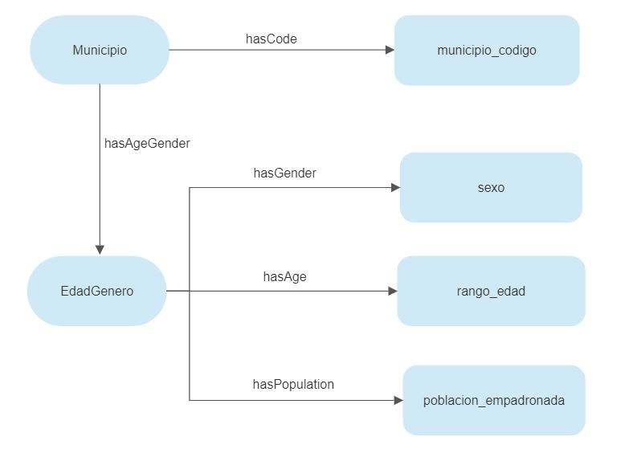
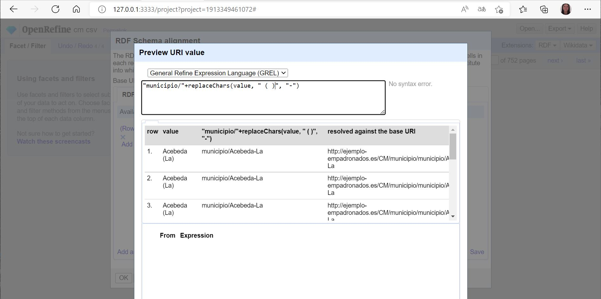
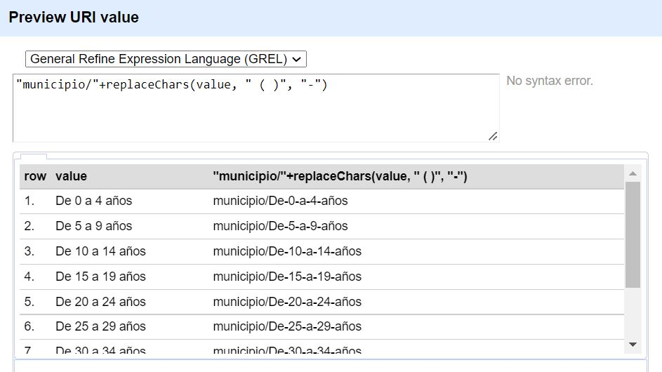
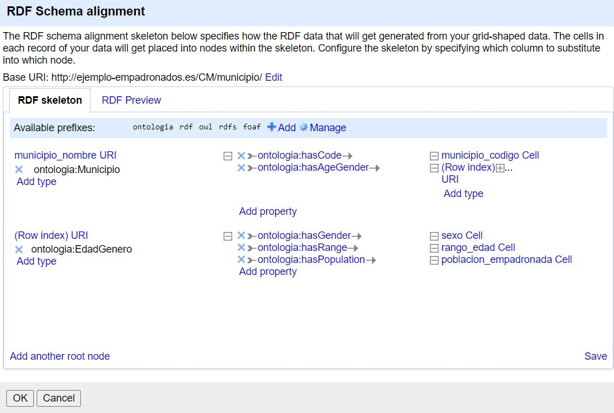
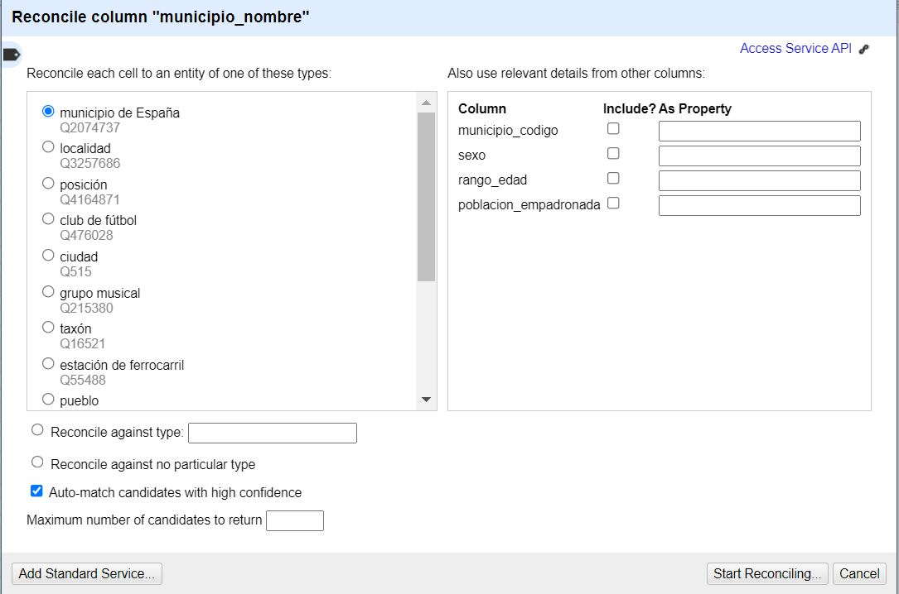
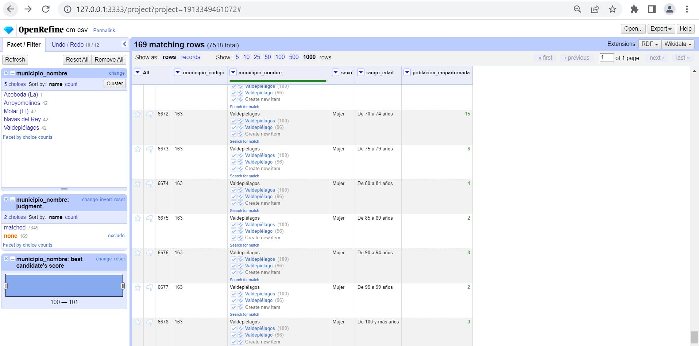

## 1. Introducción
El objetivo de este trabajo es la transformación de un conjunto de datos de origen CSV a datos enlazados de acuerdo a las guías metodológicas descritas en el curso. Para ello, he seleccionado unos datos de personas empadronadas en los municipios de la Comunidad de Madrid por rango de edad y sexo. 

## 2. Proceso de transformación
En los próximos apartados, se describirá todo el proceso de transformación de los datos, desde la elección del conjunto de datos hasta su publicación. Primero comenzaremos explicando la licencia original del dataset y la que emplearemos. A continuación, describiremos las características del conjunto de datos. Continuaremos definiendo la estrategia de nombrado de recursos y el desarrollo del vocabulario, apartado en el que se creará la ontología que usaremos en la transformación del conjunto de datos al grafo RDF. Seguidamente, se estudiará y definirá el enlazado de los recursos de nuestro dataset con los encontrados en la Web. Para finalizar el bloque, se realizará la publicación correspondiente.

### a) Selección de la fuente de datos
La fuente de datos seleccionada proviene del portal de datos abiertos del Gobierno de España (https://datos.gob.es/es/catalogo/a13002908-residentes-en-la-comunidad-de-madrid-por-rango-de-edad1). En concreto, he seleccionado el dataset “Residentes en la Comunidad de Madrid por Rango de Edad”, el cuál contiene datos de las personas empadronadas en los diferentes municipios de la Comunidad de Madrid distribuidos por sexo y rango de edad. He escogido este dataset porque se trata de un escenario real de datos fácilmente accesibles que pueden ser actualizados. 

### b) Análisis de los datos
Antes de comenzar con el análisis de los datos, debemos conocer la licencia del conjunto de datos. La licencia del dataset que hemos utilizado pertenece a “Licencias Públicas de Creative Commons”. Esta licencia permite usar los datos a cualquier persona y con cualquier fin, ya sea comercial o no, siempre que se indique la atribución de éstos. Por lo tanto, utilizaremos la misma licencia para los datos transformados obtenidos en este proyecto.

Una vez definida la procedencia de los datos, se procede a la realización del análisis para entender el conjunto de datos. Para ello he usado la herramienta OpenRefine. El dataset contiene 7518 registros agrupados en los siguientes campos:

| Columna | Tipo | Rango de valores | Comentarios |
| ------------- | ------------- | -------------| ------------- | 
| municipio_codigo | String | [1, ..., 903] | Contiene el código del municipio perteneciente a la Comunidad de Madrid. Hay 179 códigos de municipios.  |
| municipio_nombre | String | [Acebeda (La), ..., Zarzalejo] | Contiene el nombre del municipio perteneciente a la Comunidad de Madrid. Hay un total de 179 municipios. Está directamente relacionado con la variable *municipio_codigo*.|
| sexo | String | [Mujer, Hombre] | Contiene la identificación del sexo de la persona. Hay 3759 registros de hombres y 3759 registros de mujeres. |
| rango_edad | String | [De 0 a 4 años, …, De 100 y más años] | Contiene el rango de edad de las personas empadronadas. Hay un total de 21 rangos posibles de edad agrupadas por grupos quinquenales. |
| poblacion_empadronada | Numérica | [0, .., 137406] | Contiene la cantidad de personas que están empadronadas en un municipio. |

Como se puede observar, el conjunto de datos no tiene ningún tipo de error ni valor nulo. 

### c) Estrategia de nombrado
Para elegir la estrategia de nombrado de los recursos, primero hay que elegir la forma de las URIs, es decir, saber si vamos a usar “/” o “#”. En este ejemplo, he decidido utilizar URIs con almohadilla (#) para los términos ontológicos y URIs con barra inclinada (/) para los individuos. 
A continuación, debemos elegir el dominio que utilizaremos para las URIs, la ruta de las URIs y los patrones que seguiremos para nombrar clases, propiedades e individuos.
-	Dominio: http://ejemplo-empadronados.es
-	Ruta para términos ontológicos: http://ejemplo-empadronados.es/CM/municipio#
-	Ruta para individuos: http://ejemplo-empadronados.es/CM/municipio/
-	Patrón para términos ontológicos: http://ejemplo-empadronados.es/CM/municipio#
-	Patrón para individuos: http://ejemplo-empadronados.es/CM/municipio/edad

### d) Desarrollo del vocabulario
Para las relaciones entre columnas, se ha partido de la columna de *municipio_nombre* que es el nombre de un municipio de la Comunidad de Madrid. A partir de esta columna, se han ido relacionando el resto de campos del dataset.

En la figura del apartado siguiente, se observa el "RDF skeleton" que incluye las relaciones establecidas con los vocabularios, ontologias y propiedades empleadas.

### e) Proceso de transformación de los datos
El proceso de transformación de los datos adapta los datos inicales para una posterior transformación a datos enlazados en RDF. Para este proceso, he usado la herramienta OpenRefine con la extensión RDF. Las acciones que se han realizado son las siguientes:

- Transformación de columnas numéricas. Se transforma la columna *poblacion_empadronada* a numérica. 
- Eliminación de carácteres. En la fase de mapeo, las columnas *municipio_nombre* y *rango_edad* se crean con carácteres erroneos. Por tanto se utilizan expresiones GREL para sustituir esos carácteres por un guión.

- Creación esquema RDF. 

### f) Enlazado
Se decide realizar la reconciliación solo de la columna *municipio_nombre* ya que el resto de columnas no sugieren información muy precisa. Al realizar esta reconciliación con Wikidata España, nos sugiere reconciliar nuestra columna *municipio_nombre* con *Municipios de España*. Si realizo la reconciliación se asocian todos ellos salvo cinco municipios, los cuales decido asociar manualmente.

### g) Publicación
Por falta de una mayor aplicación y explotación de los datos, se decide no publicarlos por el momento.

## 3. Aplicación y explotación
Para realizar la explotación de los datos se decide utilizar la plataforma Eclipse, que es un IDE de Java, utilizando Jena para realizar las consultas SPARQL.

## 4. Conclusiones

## 5. Bibliografía
 - https://datos.gob.es/es/catalogo/a13002908-residentes-en-la-comunidad-de-madrid-por-rango-de-edad1
 
